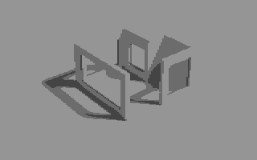
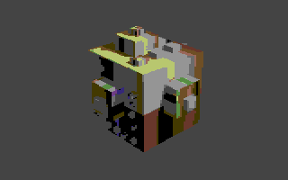
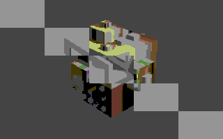
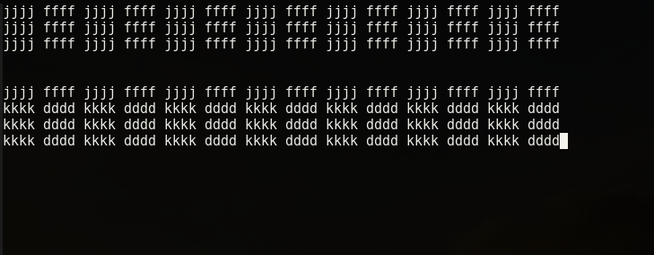
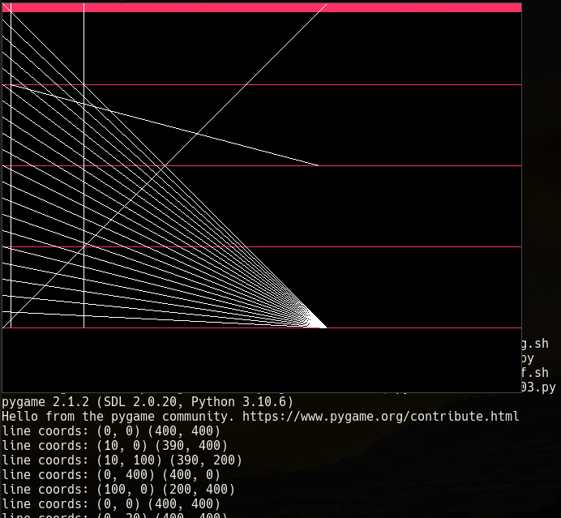
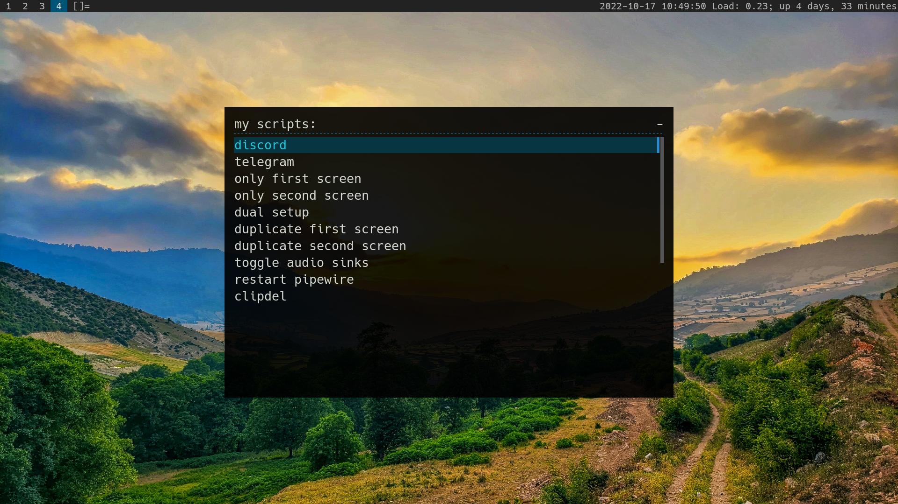
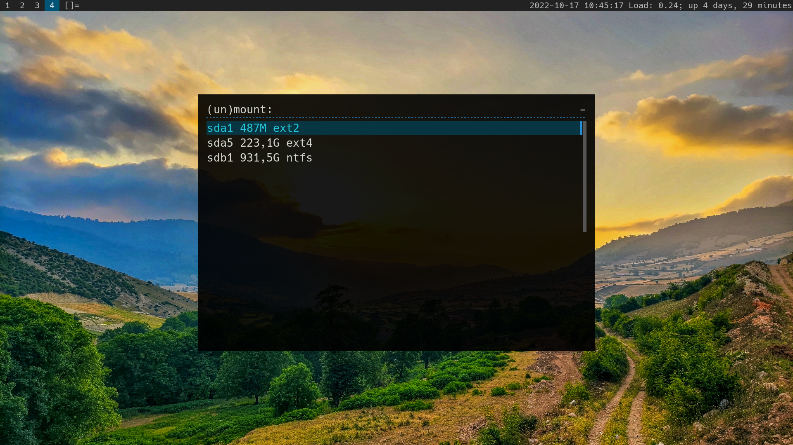
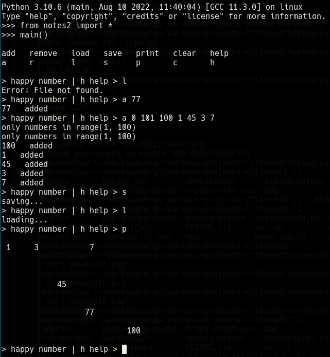
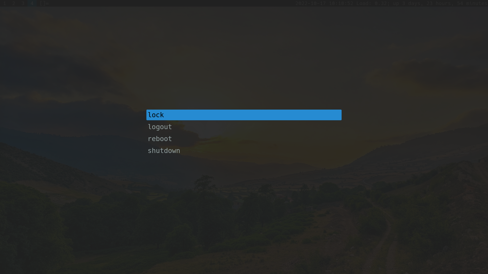

# apprun

bash script

AppImage run helper.
Script searches in its directory given as argument file that are longer
than given name and tries to run it. Thanks to this you can put
*.desktop entry in config directory, and run it from system applications menu.

# encode_mp3

bash script

Encode wave files into mp3.
Inside "encode.txt" file, type title, artist, track names, track count
and run "encode.sh" scipt to get mp3s with preformated file names.

# koala-copy-paste

python 3, terminal

Copy part of one Koala format image to another.

Example input images:




Output:



# mWesselCalc

Android, Java + Eclipse

Dedicated app for calculating form dimensions and how to cut laminate sheet.

# track-print-asm

linux assembly, terminal

Print Protracker music moudule info.

# typing-python

Python 3 + ncurses

Terminal app to learn typing.



# app

bash, interactive menu

Script for killing apps.

Usage: app program-name

# bresenham03.py

python 3 + pygame ( SDL ) library

Draw lines using bresenham algorithm using whole numbers ( no floating point ).



# csr.sh

bash + rofi

Custom Scripts Runner - graphics menu for running scripts and applications.
Scripts are stored inside $UDIR variable folder inside script.



# csr-scripts

```
"csr-scripts" catalog contains scripts utilized by csr.sh script:

clipdel.sh                  # clean clipboard history
dual_screen.sh              # bash script for dual screen setup configuration
restartpipewire.sh          # restart pipewire sound system
togglesinks-pipewire.sh     # switch audio output if there is more than one
```

# jmtpfs-mount.sh

Script for mounting Android devices.

# mounting.sh

Bash + Rofi

Script for mounting / unmounting devices.



# notes2.py

python 3, terminal

Helper script for remembering numbers in range(1, 100).

```
a 77    # adds 77 to the notes
a 1 2 3 # adds multiple numbers
r 77    # remove 77 from notes
r 1 2 3 # remove multiple numbers
s       # save notes to file
l       # load notes from file
```



# poweroff.sh

Bash + Rofi with custom theme

Script for lock/logout/reboot/poweroff.



